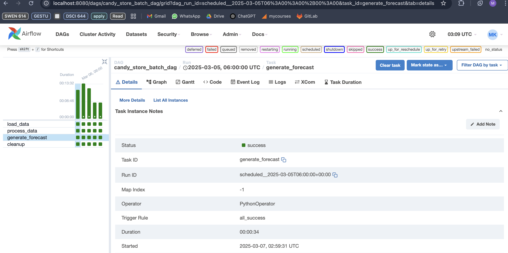

# Batch Processing ETL Pipeline for Candy Store

This project implements batch processing logic to process raw order transactions at the end of each day. This process includes validating transaction details and verifying inventory levels to ensure successful order shipment. It also puts the daily sales and profit numbers into a time series forecasting model to predict future sales and profits.

## Setup Instructions
### 1. Environment Setup

1. Create a Python virtual environment (optional):
   ```bash
   python -m venv venv
   source venv/bin/activate 
   ```


2. Copy the environment template:
   ```bash
   cp .env.example .env
   ```

3. Edit `.env` with your database credentials and paths

### 2. Installation
Install the package in development mode:
```bash
# From the project root directory
pip install -e .
```

### 3. Project Structure
```
project-root/
├── .gitlab           # merge request temples
├── .gitignore        # Git ignore patterns
├── .gitlab-ci.yml    # GitLab CI/CD configuration
├── data/
│   ├── answers_22/   # Time series implementation
│   ├── dataset_22/
│   ├── outputs/
├── src/
│    ├── time_series.py   # Time series implementation
│    ├── main.py          # Main application code
│    └── data_processor.py   # Data processing implementation
├── candy_dag.py
├── setup.py
├── README.md 
```
### 4. Data Loading
The dataset is first loaded into MySQL and MongoDB. 2 CSV Files to MySQL and 10 JSON files to MongoDB.

```
Uncomment the code in main.py to load csv and json to MySQL and MongoDB.
The transaction data is loaded from MongoDB for 10 days, in batches using for loop.
```

### 5. Data Processing
The data is then processed using "process_daily_transactions()" in data_processor.py. The generated DFs are sorted as required in the expected output.

### 6. Forecast Generation
The forecast is then generated for the 11th day transaction. The outputs are stored in data/output/ folder.

### 7. Setting up Apache Workflow
1. Install Airflow Python package (recommended in your virtual environment if you have one):
    
    ```
    pip install apache-airflow
    ```
2. Initialize the Airflow database:
    
    ```
    airflow db init
    ```
3. Create an Airflow user and set up password:
    
    ```
    airflow users create \\
        --username <Your-username> \\
        --firstname <Your-name> \\
        --lastname <Your-name> \\
        --role Admin \\
        --email <Your-email>
    ```
    
    You'll be prompted to set a password for this user.
    
4. Start the Airflow webserver:
    
    ```
    airflow webserver --port 8080
    ```
    
5. Start the Airflow scheduler (in new terminal window):
    
    ```
    airflow scheduler
    ```
    
6. Copy the file named `candy_dag.py` and paste it in the `~/airflow/dags/` directory. Also copy `data_processor.py`, `time_series.py` and `.env` file.
   
7. You can access the Airflow UI by going to `http://localhost:8080` in your web browser.

  - Open a web browser and go to `http://localhost:8080`
  - Log in with the user you created in step 4
  - Find 'candy_dag' in the DAGs list, and trigger the workflow. It successfully runs:
  - 

***
